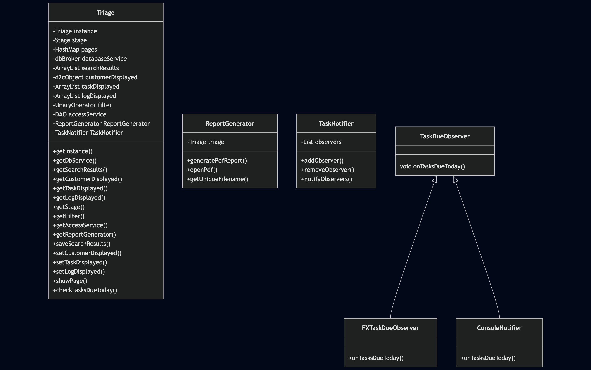

# CS1OP-CW1

## Customer Relations Manager (CRM) Program
- Module Code:  **CS1OP**
- Assignment report Title: **Direct2Consumer**
- Student Number (e.g. 25098635): **33026517**
- Actual hrs spent for the assignment: **40**
- Which Artificial Intelligence tools used (if applicable): **ChatGPT for Observer Design Pattern**


## Implementation highlights

* Connects to local **PostgreSQL** via **JDBC**, schema + seed data included via **SQL scripts**
* The GUI is written using **JavaFX**, styled with **CSS**
* Model-View-Controller-Controller Design
* Easy to use interface
* **JUnit 5** tests included
* Factory design pattern implements object creation across **Customer**, **Log** and **Task** instances - using '**d2cObject**' and '**d2cFactory**' abstract classes
* Observer design pattern implements dynamic notifications of any customer tasks due on the same day as the system's **LocalDate** current date
* Singleton design pattern implements the global state-managing '**Triage**' class 
* Reports functionality implemented with **JasperReports**, using **jrxml** files created in **JasperStudio**. They connect directly to the Postgres database
* A product directory is included, as well as functionality to track customer spending, and create reports to detail product performance
* Logs and tasks can be added to each customer seamlessly, as well as an application-wide '**All current outstanding tasks**' view
* **Parameter-safe SQL** is ensured. Similarly, user inputs are protected against using **TextFilters** applied to **JavaFX controls**

## Model-View-Controller-Controller

* Each application '**page**' is its own **JavaFX view.java** file
* Each view has its own **controller.java** file, which manages the JavaFX controls
* Java Beans and JavaFX Properties are used for seamless Table & ListView population
* A global '**Triage**' singleton class controls the application and makes sure there aren't any unnecessary instances of anything
* '**Triage**' holds access to the Data Transfer Object, globally-stored variables designed for transporting information between pages, and loose-coupling
* '**DialogueEngine**' simulates pop-ups; JavaFX doesn't have a built-in class for this 

## Design 
### Core controller classes:

### Creation classes:

### View controller classes:

### Testing classes:

### System Architecture:


## Screenshots

| Welcome Page                          |
|---------------------------------------|
|  |

| Add Customer                      |
|-----------------------------------|
|  |

| Product View                           |
|----------------------------------------|
|  |

| In-depth Customer View                 |
|----------------------------------------|
|  |
---


## Installation

### Assumptions
- Java 17+
- Maven 3.8+
- PostgreSQL 14+

### Clone and Build
> Note:  
> The local PostgreSQL database this application was developed with is **not** automatically activated by Maven. Under the ‘**resources**’ directory there is both a **seed.sql** and a **schema.sql** file for a user to be able to easily recreate the exact database environment on their local machine. Once you have created a local instance, just input your host, username and password in the clearly marked **DAO.java** variables.

```bash
git clone https://csgitlab.reading.ac.uk/mo026517/cs1op-cw1.git
cd cs1op-cw1
mvn clean install
